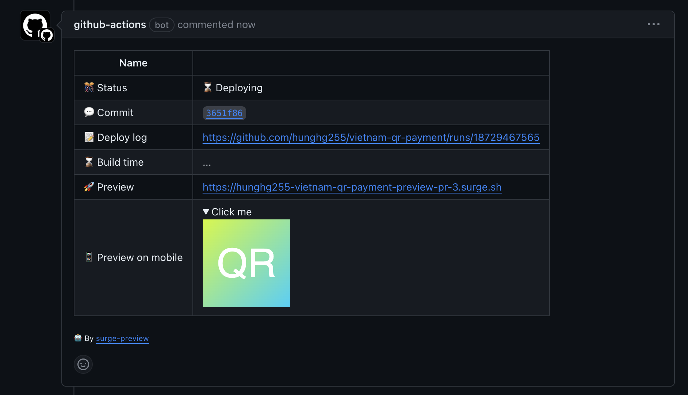

# Surge PR Preview

A GitHub action that preview website in [surge.sh](https://surge.sh/) for your pull requests.




## Pros

Compare to Netlify/Vercel?

- It is **free**.
- It supports multiple preview jobs.

## Usage

Add a workflow (`.github/workflows/preview.yml`):

```yaml
name: 🔂 Preview Pull Request

on:
  pull_request:
    types:
      - opened
      - synchronize
      - closed
    branches:
      - dev

concurrency:
  group: ${{ github.workflow }}-${{ github.ref }}
  cancel-in-progress: true

jobs:
  preview:
    runs-on: ubuntu-latest
    permissions:
      pull-requests: write
      contents: read
    steps:
      - uses: actions/checkout@v3
        with:
          fetch-depth: 0

      - uses: actions/setup-node@v3
        with:
          node-version: 18.x
      - uses: hunghg255/surge-preview@master
        id: preview_step
        with:
          surge_token: ${{ secrets.SURGE_TOKEN }}
          github_token: ${{ secrets.GH_TOKEN }}
          dist: dist
          failOnError: true
          build: |
            npm install
            npm run build
      - name: Get the preview_url
        run: echo "url => ${{ steps.preview_step.outputs.preview_url }}"
```

The preview website url will be `https://{{repository.owner}}-{{repository.name}}-{{job.name}}-pr-{{pr.number}}.surge.sh`.

The preview website urls will be:

- `https://{{repository.owner}}-{{repository.name}}-preview-job-1-pr-{{pr.number}}.surge.sh`
- `https://{{repository.owner}}-{{repository.name}}-preview-job-2-pr-{{pr.number}}.surge.sh`

## Teardown

When a pull request is closed and teardown is set to 'true', then the surge instance will be destroyed.

```yaml
name: 🔂 Preview Pull Request

on:
  pull_request:
    types:
      - opened
      - synchronize
      - closed
    branches:
      - dev

concurrency:
  group: ${{ github.workflow }}-${{ github.ref }}
  cancel-in-progress: true

jobs:
  preview:
    runs-on: ubuntu-latest
    permissions:
      pull-requests: write
      contents: read
    steps:
      - uses: actions/checkout@v3
        with:
          fetch-depth: 0

      - uses: actions/setup-node@v3
        with:
          node-version: 18.x
      - uses: hunghg255/surge-preview@master
        id: preview_step
        with:
          surge_token: ${{ secrets.SURGE_TOKEN }}
          github_token: ${{ secrets.GH_TOKEN }}
          dist: dist
          failOnError: true
          teardown: 'true'
          build: |
            npm install
            npm run build
      - name: Get the preview_url
        run: echo "url => ${{ steps.preview_step.outputs.preview_url }}"
```

## Inputs

- `surge_token`: [Getting your Surge token](https://surge.sh/help/integrating-with-circleci).
- `github_token`: Defaults: [`github.token`](https://docs.github.com/en/actions/security-guides/automatic-token-authentication#using-the-github_token-in-a-workflow). It is used to create Pull Request comment, so it requires the `pull-requests` permission set to `write` permission. Possible value: `secrets.GITHUB_TOKEN`.
- `build`: build scripts to run before deploy.
- `dist`: dist folder deployed to [surge.sh](https://surge.sh/).
- `failOnError`: Set `failed` if a deployment throws error, defaults to `false`.
- `teardown`: Determines if the preview instance will be torn down on PR close, defaults to `false`.
- `preview_branch`: deploy to a branch, defaults to `false`.

## Outputs

- `preview_url`: The url for the related PR preview
